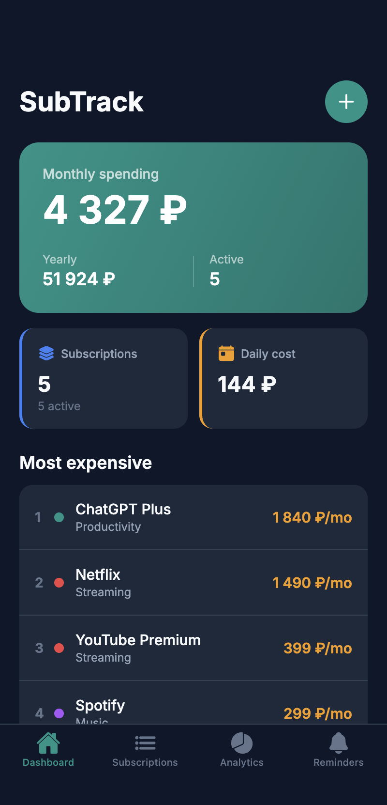
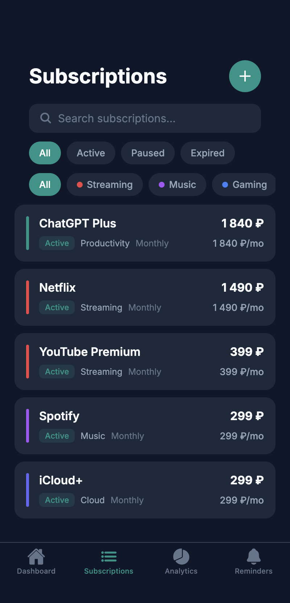
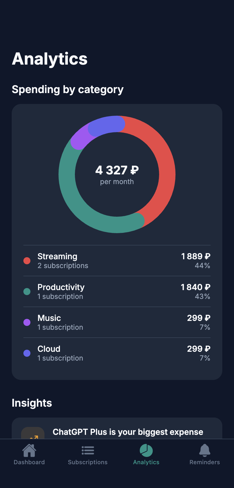

# SubTrack

Трекер подписок — мобильное приложение. Создано без единой строчки кода вручную.

Демо-проект курса [«Вайбкодинг: мобильное приложение за 3 недели»](https://github.com/serejaris/teach-vibecoding-mobile).

## Скриншоты

<p align="center">
  
  
  
</p>

## Что умеет

- Дашборд — сколько ты тратишь на подписки в месяц
- Добавление, редактирование, удаление подписок
- Аналитика по категориям (стриминг, музыка, игры и т.д.)
- Напоминания о списаниях
- Поддержка рублей, долларов и евро
- Онбординг с популярными подписками

## Как создавался

Экспорт из [Replit](https://replit.com/@serejaris/Subscription-Insight) — на уроке 1 курса AI-агент сгенерировал приложение по промпту. Код руками не писали.

## Ветки

| Ветка | Что внутри |
|-------|------------|
| `main` | Актуальная версия |
| `lesson-4-start` | Снимок до добавления онбординга — старт урока 5 |

## Как запустить

**VS Code (с урока 4):**
1. Code → Download ZIP → распакуй в удобную папку
2. Открой папку в VS Code (File → Open Folder)
3. Открой Copilot Chat и напиши: «Установи все зависимости и запусти проект»
4. Приложение откроется в браузере. На телефоне — через [Expo Go](https://expo.dev/go)

**Replit (урок 1):**
1. Открой [Replit](https://replit.com) → Import from GitHub → вставь ссылку на этот репозиторий
2. Нажми Run

---

## Промпты из курса

### Дизайн онбординга в Google Stitch

Открой [stitch.withgoogle.com](https://stitch.withgoogle.com) → App → 3 Flash. Вставь:

```
Onboarding for a subscription tracker app "Sub Tracker".
5 mobile screens: welcome, 3 quiz questions about spending habits, results.
Style: dark theme, green accents, rounded cards.
```

20 секунд — 5 экранов готовы. Не нравится — дописывай модификации в то же поле.

### Промпт для AI-агента (VS Code Copilot / Claude Code / Cursor)

Скопируй HTML из Stitch (вкладка Code), вставь в чат агенту, и допиши:

```
Добавь онбординг в моё приложение. Дизайн экранов — в коде выше.

Экраны:
1. Welcome — "Track Your Subscriptions", кнопка "Get Started"
2. Квиз — 3 вопроса
3. Загрузка с прогресс-баром
4. Результат

Сначала составь план.
```

Агент сначала покажет план — одобряешь, и он строит.

### Если делал урок 3

На уроке 3 ты генерировал структуру онбординга в ChatGPT / Gemini / Claude — экраны, тексты кнопок, варианты ответов квиза. Можно вставить этот текст целиком в Stitch вместо трёх строк — дизайн будет точнее, потому что Stitch увидит все детали.

---

## Лицензия

Учебный проект. Используйте как хотите.
